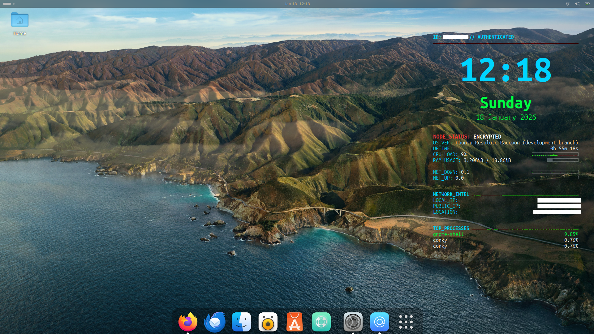

🛡️ Omni-System-Monitor

A stunning, AI-customizable system monitoring overlay for Ubuntu 24.04+.

Featuring real-time network intel, persistent detached process logic, and dynamic hardware detection for a professional cybersecurity aesthetic.

🔰 One-Line Installation Command

Once your script is uploaded, you can give your friends this "Pro" command to run in their terminal. It will download and start your installer automatically:

Bash

	wget -qO- https://raw.githubusercontent.com/smazumdar261-IN/Omni-System-Monitor/main/install_dashboard.sh | bash

🚀 Key Features

➡️  Universal Hardware Support: Automatically detects your active network interface (Wi-Fi or Ethernet).

➡️  Persistent Monitoring: Uses double-fork logic to stay active even after the terminal is closed.

➡️  Reliable Autostart: Includes a 20-second delayed launch to ensure the system tray is ready before the dashboard appears.

➡️  AI-Ready: Designed to be customized with AI-generated color palettes for any wallpaper.
	

📦 Installation Instructions

Follow these steps to set up the monitor on your system:

☣️  Download the file named install_dashboard.sh from this repository.

☣️  Open your Terminal in the folder where you saved the file.

☣️  Execute the Installer by running the command below:

Bash

  	bash ./install_dashboard.sh

  Note: You may be asked for your sudo password during installation to set up the necessary conky-all and zenity dependencies.
	

🎨 Professional Color Customization

To match the monitor to your specific wallpaper, upload your background image to an AI (like Gemini) and use the following prompt:

--- Copy & Paste this Prompt for Gemini ---

    "I have uploaded my desktop wallpaper. I am installing a custom Linux dashboard that requires specific Hex color codes. Please analyze my background image and suggest 5 Hex codes that look 'stunning' and professional for my dashboard.

    Provide ONLY the 6-character Hex code (e.g., 00FF41) in this format:

        TIME Color: (Vibrant contrast color)

        DAY Color: (Matches a minor detail in the image)

        DATE Color: (Complementary color)

        HEADERS Color: (Technical/neon color)

        STATS Color: (Progress bars and graphs)

    Note: If the background is bright, suggest High-Contrast/Dark codes."
		

⚖️ License

This project is licensed under the MIT License. See the LICENSE file for more details.
